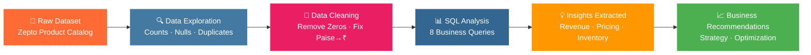

<div align="center">

<!-- HERO BANNER -->


<!-- BADGES -->
<p align="center">
  
  
  
  
  
</p>

<p align="center">
  
  
  
  
</p>

<br/>

> **🛒 A deep-dive SQL analysis of Zepto's grocery product catalog — uncovering pricing strategy, inventory health, discount patterns, and revenue opportunities through data-driven SQL queries.**

<br/>

</div>

---

## 📌 Table of Contents

<div align="center">

| # | Section |
|---|---------|
| 01 | [🧠 Project Overview](#-project-overview) |
| 02 | [📦 Dataset Overview](#-dataset-overview) |
| 03 | [❓ Problem Statements Solved](#-problem-statements-solved) |
| 04 | [⚙️ SQL Concepts Used](#%EF%B8%8F-sql-concepts-used) |
| 05 | [🔄 Project Workflow](#-project-workflow) |
| 06 | [🔍 Queries & Analysis](#-queries--analysis) |
| 07 | [💡 Key Insights](#-key-insights) |
| 08 | [📊 Visual Analytics](#-visual-analytics) |
| 09 | [📁 Folder Structure](#-folder-structure) |
| 10 | [🎓 Learning Outcomes](#-learning-outcomes) |
| 11 | [🚀 Future Improvements](#-future-improvements) |
| 12 | [🛠️ Installation & Usage](#%EF%B8%8F-installation--usage) |
| 13 | [🤝 Contributing](#-contributing) |
| 14 | [🌐 Connect With Me](#-connect-with-me) |

</div>

---

## 🧠 Project Overview

<div align="center">

</div>

<br/>

**Zepto** is India's pioneering **10-minute grocery delivery** startup, operating on a hyperlocal quick-commerce model. This project performs an end-to-end **SQL-based analysis** on Zepto's product catalog data to extract meaningful business insights.

### 🎯 Why This Project?

| Reason | Details |
|--------|---------|
| 📈 **Business Value** | Quick commerce is a ₹45,000 Cr+ industry — data decisions drive margins |
| 🧹 **Data Cleaning** | Real-world messy data (prices in paise, zero-value records, nulls) |
| 📊 **Analytics** | Revenue estimation, discount strategy, inventory health — all via SQL |
| 💼 **Career Relevance** | Demonstrates end-to-end analyst skills from raw data to business insight |

### 🏆 Business Problem Solved

> *"How can Zepto optimize its product pricing, discount strategy, and inventory management to maximize revenue while ensuring product availability for high-demand categories?"*

---

## 📦 Dataset Overview

<div align="center">


</div>

<br/>

The dataset represents a **product catalog snapshot** from Zepto's grocery platform, covering SKUs across multiple categories.

### 🗂️ Schema Definition

```sql
CREATE TABLE zepto (
    sku_id              SERIAL PRIMARY KEY,      -- Unique product identifier
    category            VARCHAR(120),            -- Product category (e.g., Dairy, Snacks)
    name                VARCHAR(150) NOT NULL,   -- Product name
    mrp                 NUMERIC(8,2),            -- Maximum Retail Price (₹)
    discountPercent     NUMERIC(5,2),            -- Discount offered (%)
    availableQuantity   INTEGER,                 -- Units in stock
    discountedSellingPrice NUMERIC(8,2),         -- Final selling price (₹)
    weightInGms         INTEGER,                 -- Product weight in grams
    outOfStock          BOOLEAN,                 -- Stock availability flag
    quantity            INTEGER                  -- Pack quantity
);
```

### 📋 Column Reference Table

| Column | Type | Description | Example |
|--------|------|-------------|---------|
| `sku_id` | SERIAL | Auto-incremented product ID | 1, 2, 3… |
| `category` | VARCHAR | Product category name | `"Dairy & Breakfast"` |
| `name` | VARCHAR | Full product name | `"Amul Taaza Milk 500ml"` |
| `mrp` | NUMERIC | MRP in ₹ (post-cleaning) | `₹49.00` |
| `discountPercent` | NUMERIC | Discount % on MRP | `15.50` |
| `availableQuantity` | INTEGER | Current stock units | `250` |
| `discountedSellingPrice` | NUMERIC | Effective price after discount | `₹41.40` |
| `weightInGms` | INTEGER | Weight in grams | `500` |
| `outOfStock` | BOOLEAN | True = out of stock | `false` |
| `quantity` | INTEGER | Pack size quantity | `1` |

---

## ❓ Problem Statements Solved

<div align="center">

```
🎯 8 Real-World Business Questions Answered with SQL
```

</div>

| # | Problem Statement | Category | Complexity |
|---|-------------------|----------|------------|
| ✅ **Q1** | Top 10 best-value products by discount % | Pricing | 🟢 Beginner |
| ✅ **Q2** | High MRP products that are out of stock | Inventory | 🟢 Beginner |
| ✅ **Q3** | Estimated revenue per category | Revenue | 🟡 Intermediate |
| ✅ **Q4** | Products with MRP > ₹500 and discount < 10% | Pricing | 🟢 Beginner |
| ✅ **Q5** | Top 5 categories by average discount | Strategy | 🟡 Intermediate |
| ✅ **Q6** | Price per gram analysis for products above 100g | Value | 🟡 Intermediate |
| ✅ **Q7** | Product weight segmentation (Low / Medium / Bulk) | Segmentation | 🟡 Intermediate |
| ✅ **Q8** | Total inventory weight per category | Supply Chain | 🟡 Intermediate |

---

## ⚙️ SQL Concepts Used

<div align="center">


</div>

<br/>

| Concept | Used In | Purpose |
|---------|---------|---------|
| `SELECT DISTINCT` | Q1, Q2, Q4, Q6, Q7 | Eliminate duplicate product name rows |
| `WHERE` | Q2, Q4, Q6 | Filter by stock status, price thresholds, weight |
| `GROUP BY` | Q3, Q5, Q8 | Aggregate data by category |
| `HAVING` | Data Exploration | Filter groups (e.g., duplicate SKU names) |
| `ORDER BY` | All queries | Sort results by relevance (price, discount, weight) |
| `CASE WHEN` | Q7 | Segment products into Low / Medium / Bulk |
| `ROUND()` | Q5, Q6 | Clean numeric output to 2 decimal places |
| `SUM()` | Q3, Q8 | Calculate total revenue and total inventory weight |
| `AVG()` | Q5 | Average discount per category |
| `COUNT()` | Exploration | SKU frequency & stock status counts |
| `UPDATE` | Data Cleaning | Convert paise → rupees for all price columns |
| `DELETE` | Data Cleaning | Remove zero-priced/invalid records |

---

## 🔄 Project Workflow



---

## 🔍 Queries & Analysis

<details>
<summary>🟢 <strong>Beginner Queries</strong> — Click to Expand</summary>

<br/>

### Q1 · Top 10 Best-Value Products by Discount

```sql
SELECT DISTINCT name, mrp, discountPercent
FROM zepto
ORDER BY discountPercent DESC
LIMIT 10;
```

**📌 Insight:** Identifies heavily discounted products — useful for promotional strategy and understanding which categories drive deal-seekers.

---

### Q2 · High MRP Products That Are Out of Stock

```sql
SELECT DISTINCT name, mrp
FROM zepto
WHERE outOfStock = TRUE AND mrp > 300
ORDER BY mrp DESC;
```

**📌 Insight:** Premium products that are out of stock represent lost revenue. These should be prioritized for restocking.

---

### Q4 · Premium Products with Low Discounts

```sql
SELECT DISTINCT name, mrp, discountPercent
FROM zepto
WHERE mrp > 500 AND discountPercent < 10
ORDER BY mrp DESC, discountPercent DESC;
```

**📌 Insight:** High-value products with minimal discounts — an opportunity to offer targeted promotions to increase conversion.

</details>

---

<details>
<summary>🟡 <strong>Intermediate Queries</strong> — Click to Expand</summary>

<br/>

### Q3 · Estimated Revenue Per Category

```sql
SELECT category,
       SUM(discountedSellingPrice * availableQuantity) AS total_revenue
FROM zepto
GROUP BY category
ORDER BY total_revenue;
```

**📌 Insight:** Reveals which product categories are revenue drivers vs underperformers. Enables category-level investment decisions.

---

### Q5 · Top 5 Categories by Average Discount

```sql
SELECT category,
       ROUND(AVG(discountPercent), 2) AS avg_discount
FROM zepto
GROUP BY category
ORDER BY avg_discount DESC
LIMIT 5;
```

**📌 Insight:** Categories with consistently high discounts may be margin-eroding. Helps re-calibrate pricing strategy.

---

### Q6 · Price Per Gram — Best Value Products

```sql
SELECT DISTINCT name, weightInGms, discountedSellingPrice,
       ROUND(discountedSellingPrice / weightInGms, 2) AS price_per_gram
FROM zepto
WHERE weightInGms >= 100
ORDER BY price_per_gram;
```

**📌 Insight:** Customers can identify best-value products by weight. Useful for Zepto's "value packs" marketing.

---

### Q7 · Product Weight Segmentation

```sql
SELECT DISTINCT name, weightInGms,
       CASE
           WHEN weightInGms < 1000 THEN 'Low'
           WHEN weightInGms < 5000 THEN 'Medium'
           ELSE 'Bulk'
       END AS weight_category
FROM zepto;
```

**📌 Insight:** Segmenting products by weight helps optimize delivery logistics, packaging, and delivery fee structures.

---

### Q8 · Total Inventory Weight Per Category

```sql
SELECT category,
       SUM(weightInGms * availableQuantity) AS total_weight
FROM zepto
GROUP BY category
ORDER BY total_weight;
```

**📌 Insight:** Total weight by category impacts warehouse space planning, carrier selection, and delivery cost allocation.

</details>

---

<details>
<summary>🧹 <strong>Data Cleaning Queries</strong> — Click to Expand</summary>

<br/>

### Remove Zero-Priced Products

```sql
-- Identify invalid records
SELECT * FROM zepto WHERE mrp = 0 OR discountedSellingPrice = 0;

-- Remove zero-MRP records
DELETE FROM zepto WHERE mrp = 0;
```

### Convert Paise to Rupees

```sql
UPDATE zepto
SET mrp = mrp / 100.0,
    discountedSellingPrice = discountedSellingPrice / 100.0;
```

**📌 Note:** Raw data stored prices in paise (Indian subunit). This normalization step is critical for accurate financial analysis.

</details>

---

## 💡 Key Insights

<div align="center">

```
📊 Business Intelligence Dashboard Summary
```

</div>

| # | Insight | Business Impact |
|---|---------|----------------|
| 🏆 | **Discount strategy varies significantly by category** — some categories average 30%+ discounts | Review margin health per category |
| 💰 | **Out-of-stock premium products** (MRP > ₹300) represent direct revenue leakage | Prioritize restocking premium SKUs |
| ⚖️ | **Price-per-gram metric** reveals true value — bulk products often beat small packs | Promote value packs to price-sensitive users |
| 🔖 | **High MRP + low discount products** exist across categories — untapped promotion opportunity | Targeted discount campaigns can boost conversion |
| 📦 | **Inventory weight distribution** is uneven — some categories carry disproportionate stock | Rebalance warehouse allocation |
| 🗂️ | **Multiple SKUs per product name** detected — indicates variant tracking (size/pack) | Normalize SKU management |
| 💹 | **Revenue concentration** — top categories likely drive 80% of estimated GMV | Focus supply chain on high-revenue categories |
| 🧹 | **Data quality issues** found — zero prices and paise encoding needed cleaning | Upstream data pipeline improvement needed |

---

## 📊 Visual Analytics

> 📸 Add screenshots of your query outputs, dashboards, and ER diagrams below.

<div align="center">

| Visual | Description |
|--------|-------------|
|  | Revenue by Category Dashboard |
|  | Entity Relationship Diagram |
|  | Top Categories by Average Discount |
|  | Inventory Weight Distribution |
|  | Sample SQL Query Outputs |

</div>

> 💡 **Recommended Tools:** Power BI · Tableau · Metabase · pgAdmin Query Tool

---

## 📁 Folder Structure

```
📦 zepto-sql-data-analysis/
├── 📄 README.md                   ← You are here
├── 📂 sql/
│   ├── 01_create_table.sql        ← Schema definition
│   ├── 02_data_exploration.sql    ← Exploration queries
│   ├── 03_data_cleaning.sql       ← Cleaning steps
│   └── 04_analysis_queries.sql    ← All 8 business queries
├── 📂 dataset/
│   └── zepto_products.csv         ← Raw dataset
├── 📂 images/
│   ├── dashboard.png              ← Power BI / Tableau screenshots
│   ├── er_diagram.png             ← ER diagram
│   └── query_results/             ← Individual query output screenshots
└── 📂 reports/
    └── zepto_analysis_report.pdf  ← Final business insights report
```

---

## 🎓 Learning Outcomes

<div align="center">

| Skill Area | What I Gained |
|------------|---------------|
| 🧠 **SQL Mastery** | Practiced SELECT, WHERE, GROUP BY, HAVING, CASE WHEN, aggregation functions |
| 🧹 **Data Cleaning** | Handled real-world issues: zero prices, incorrect units, null values |
| 📊 **Business Analytics** | Translated raw data into pricing, revenue, and inventory insights |
| 💡 **Problem Solving** | Structured analysis approach: explore → clean → analyze → recommend |
| 🏭 **Domain Knowledge** | Understood quick commerce metrics: GMV, SKU management, discount strategy |
| 🔧 **Query Optimization** | Used DISTINCT, LIMIT, and indexed filtering for efficient queries |

</div>

---

## 🚀 Future Improvements

- [ ] 📊 **Power BI Dashboard** — Interactive revenue & inventory visualizations
- [ ] 🐍 **Python Integration** — Pandas + Matplotlib for advanced EDA
- [ ] 🤖 **ML Predictions** — Demand forecasting using historical sales trends
- [ ] ⏱️ **Real-Time Dashboard** — Live metrics with streaming data pipeline
- [ ] 🔗 **Joins & CTEs** — Multi-table analysis with orders + customers data
- [ ] 🪟 **Window Functions** — Running totals, rank within categories, lag/lead analysis
- [ ] ☁️ **Cloud Deployment** — Migrate to BigQuery / Snowflake / AWS RDS
- [ ] 🔄 **Automated Pipeline** — Scheduled ETL with Apache Airflow

---

## 🛠️ Installation & Usage

### Prerequisites

- PostgreSQL 13+ or MySQL 8+
- pgAdmin / DBeaver / MySQL Workbench (any SQL client)

### Setup Steps

```bash
# 1. Clone the repository
git clone https://github.com/yourusername/zepto-sql-data-analysis.git

# 2. Navigate to the project folder
cd zepto-sql-data-analysis
```

### Database Setup

```sql
-- Step 1: Create the database
CREATE DATABASE zepto_analysis;

-- Step 2: Connect to the database
\c zepto_analysis    -- PostgreSQL
USE zepto_analysis;  -- MySQL

-- Step 3: Run the schema creation script
\i sql/01_create_table.sql

-- Step 4: Import dataset (adjust path as needed)
COPY zepto FROM '/path/to/dataset/zepto_products.csv' DELIMITER ',' CSV HEADER;

-- Step 5: Run cleaning scripts
\i sql/03_data_cleaning.sql

-- Step 6: Run analysis queries
\i sql/04_analysis_queries.sql
```

---

## 🤝 Contributing

Contributions are welcome! Here's how you can help:

1. 🍴 **Fork** this repository
2. 🌿 **Create** a feature branch: `git checkout -b feature/new-analysis`
3. 💾 **Commit** your changes: `git commit -m 'Add customer segmentation query'`
4. 📤 **Push** to the branch: `git push origin feature/new-analysis`
5. 🔁 **Open a Pull Request** with a clear description

### 💡 Ideas for Contributions

- Add new business queries (cohort analysis, seasonal trends)
- Improve data cleaning scripts
- Add visualization code (Python/R)
- Write detailed query explanations

---

## 🌐 Connect With Me

<div align="center">

[](www.linkedin.com/in/yash--chaudhary--)
[](https://github.com/yashchaudhary872)
[](https://yashchaudharyportfolio.netlify.app/)
[](mailto:chaudharyyash872@gmail.com)

</div>

---

<div align="center">


**Made with ❤️ using SQL · Powered by PostgreSQL · Inspired by Zepto's Quick Commerce**

*If this project helped you, please consider giving it a ⭐ on GitHub!*


</div>
